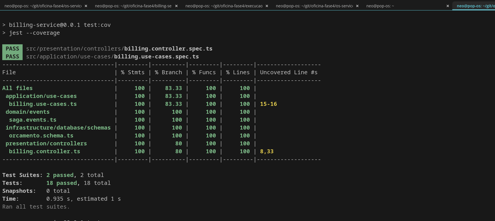

# Billing Service — Oficina Mecânica Fase 4

Microsservico responsavel por orcamentos e pagamentos via Mercado Pago.

## Stack
- Node.js 20 + NestJS + TypeScript
- MongoDB (banco nao relacional)
- RabbitMQ (mensageria assincrona)
- Mercado Pago SDK (pagamentos sandbox)

## Responsabilidades no Saga

    os.criada         -> gerar orcamento automaticamente
    os.aprovada       -> criar preferencia de pagamento no Mercado Pago
    webhook MP        -> publicar pagamento.confirmado ou pagamento.falhou
    os.cancelada      -> cancelar orcamento (compensacao)

## Endpoints

| Metodo | Rota | Descricao |
|---|---|---|
| GET | /api/v1/orcamentos | Listar orcamentos |
| GET | /api/v1/orcamentos/:osId | Buscar por OS |
| POST | /api/v1/orcamentos/:osId/pagamento | Gerar link Mercado Pago |
| POST | /api/v1/pagamentos/webhook | Webhook Mercado Pago |
| GET | /api/v1/health | Health check |

Swagger: http://localhost:3002/api/docs

## Como rodar localmente

    cp .env.example .env
    docker compose up -d mongodb-billing
    npm install
    npm run start:dev

## Testes

    npm run test:cov

| Suite | Testes | Cobertura |
|---|---|---|
| Unitarios | 18 | 100% |

## Repositorios relacionados
- OS Service: https://github.com/Tiago-Machado/Tech-CH-oficina4-os-servic
- Execucao Service: https://github.com/Tiago-Machado/Tech-CH-oficina4-execucao-service

## Evidencia de Cobertura de Testes

### Billing Service — 100% | 18 testes (2 suites)

